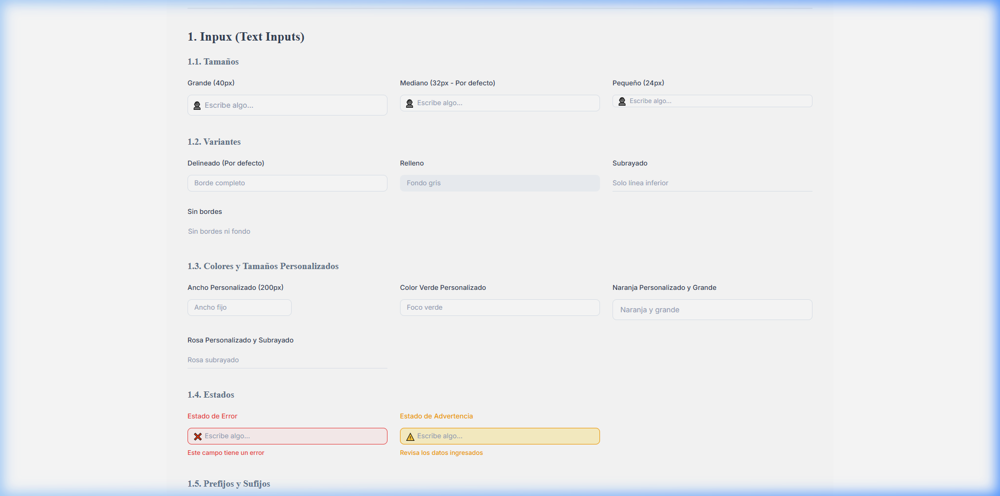
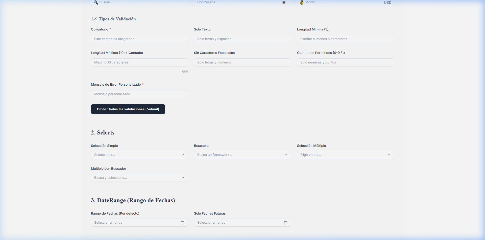
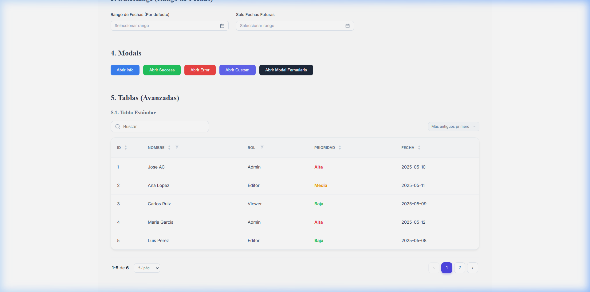
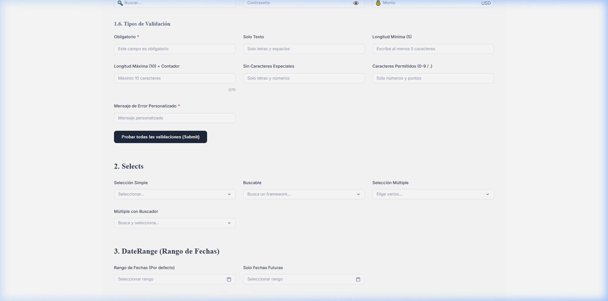

# AC Components 🚀

Librería de componentes premium para React, diseñada para ser altamente flexible, robusta y fácil de usar por desarrolladores de todos los niveles. Incluye validaciones integradas, manejo de formularios y una estética moderna.

## 📦 Instalación

Para instalar la librería en tu proyecto, ejecuta:

```bash
npm install ac-components
```

## 🚀 Uso Básico

No necesitas importar el CSS por separado, ¡ya viene incluido en la librería!

```jsx
import { Input, Select, Table } from 'ac-components';

function App() {
  return (
    <div>
      <Input label="Nombre" placeholder="Escribe tu nombre" required />
      <Select label="País" options={[{value: 'es', label: 'España'}]} />
    </div>
  );
}
```

---

## 🎨 Componentes

### 1. Input (Entradas de Texto)


Entrada de texto avanzada con soporte para validación en tiempo real, prefijos, sufijos y estados de error/advertencia.

#### Ejemplo de Uso
```jsx
import { Input } from 'ac-components';

<Input 
  label="Usuario" 
  placeholder="Escribe tu nombre de usuario" 
  required 
  prefix={<span>👤</span>}
  variant="outlined"
  color="#6366f1"
/>
```

#### API de Input
| Propiedad | Descripción | Tipo | Por defecto |
|-----------|-------------|------|-------------|
| `name` | Nombre único para el campo y validación | `string` | - |
| `label` | Etiqueta que aparece arriba del input | `string` | - |
| `showLabel` | Muestra u oculta la etiqueta | `boolean` | `true` |
| `placeholder` | Texto de ayuda dentro del campo | `string` | `'Escribe algo...'` |
| `showPlaceholder` | Muestra u oculta el placeholder | `boolean` | `true` |
| `type` | Tipo de input (text, password, number, email, etc.) | `string` | `'text'` |
| `value` | Valor controlado del input | `string \| number` | - |
| `defaultValue` | Valor inicial (modo no controlado) | `string \| number` | `''` |
| `width` | Ancho del componente (px, %, etc) | `string \| number` | `'100%'` |
| `height` | Alto del campo de entrada | `string \| number` | - |
| `size` | Tamaño del componente | `'small' \| 'medium' \| 'large'` | `'medium'` |
| `variant` | Estilo visual del input | `'outlined' \| 'filled' \| 'underlined' \| 'borderless'` | `'outlined'` |
| `color` | Color principal (foco y acento) | `string` | `'#6366f1'` |
| `required` | Si el campo es obligatorio | `boolean` | `false` |
| `minLength` | Cantidad mínima de caracteres | `number` | - |
| `maxLength` | Cantidad máxima de caracteres | `number` | - |
| `textOnly` | Bloquea todo lo que no sea letras | `boolean` | `false` |
| `allowSpecialChars`| Permite o bloquea caracteres especiales | `boolean` | `true` |
| `allowedChars` | Regex o cadena de caracteres permitidos | `string` | - |
| `showCounter` | Muestra contador de caracteres | `boolean` | `false` |
| `prefix` | Elemento o icono al inicio | `ReactNode` | - |
| `suffix` | Elemento o icono al final | `ReactNode` | - |
| `status` | Estado visual del campo | `'default' \| 'error' \| 'warning'` | `'default'` |
| `errorMessage` | Mensaje de error personalizado | `string` | - |
| `disabled` | Deshabilita el campo | `boolean` | `false` |
| `readOnly` | Pone el campo en modo lectura | `boolean` | `false` |
| `autoComplete` | Atributo autocomplete de HTML | `string` | - |
| `className` | Clases CSS adicionales | `string` | - |
| `style` | Estilos inline adicionales | `object` | - |
| `onChange` | Callback al cambiar el valor | `function(val, event)` | - |
| `onBlur` | Callback al perder el foco | `function(event)` | - |
| `onFocus` | Callback al ganar el foco | `function(event)` | - |

### 2. Select (Selector Premium)


Selector personalizable que soporta búsqueda, selección múltiple y limpieza de datos.

#### Ejemplo de Uso
```jsx
import { Select } from 'ac-components';

const options = [
  { value: 'react', label: 'React' },
  { value: 'vue', label: 'Vue' }
];

<Select 
  label="Framework Favorito" 
  options={options} 
  searchable 
  multiple 
  placeholder="Selecciona uno o varios" 
/>
```

#### API de Select
| Propiedad | Descripción | Tipo | Por defecto |
|-----------|-------------|------|-------------|
| `name` | Nombre del campo | `string` | - |
| `label` | Etiqueta del selector | `string` | - |
| `showLabel` | Muestra u oculta la etiqueta | `boolean` | `true` |
| `options` | Lista de opciones | `{value, label}[]` | `[]` |
| `value` | Valor seleccionado (controlado) | `any \| any[]` | - |
| `defaultValue` | Valor inicial | `any \| any[]` | - |
| `placeholder` | Texto cuando no hay selección | `string` | `'Seleccionar...'` |
| `searchable` | Habilita búsqueda interna | `boolean` | `false` |
| `searchPlaceholder`| Placeholder del buscador | `string` | `'Buscar...'` |
| `multiple` | Permite selección múltiple | `boolean` | `false` |
| `clearable` | Permite limpiar la selección | `boolean` | `false` |
| `width` | Ancho total | `string \| number` | `'100%'` |
| `height` | Alto del selector | `string \| number` | - |
| `maxDropdownHeight`| Alto máximo del menú desplegable | `number` | - |
| `color` | Color de realce y foco | `string` | `'#6366f1'` |
| `noResultsText` | Texto cuando no hay coincidencias | `string` | `'Sin resultados'` |
| `disabled` | Deshabilita el selector | `boolean` | `false` |
| `required` | Marca como obligatorio | `boolean` | `false` |
| `className` | Clases CSS adicionales | `string` | - |
| `style` | Estilos inline adicionales | `object` | - |
| `onChange` | Callback al cambiar selección | `function(val)` | - |
| `onBlur` | Callback al perder foco | `function(event)` | - |

### 3. Table (Grid de Datos Avanzado)


Potente grid de datos con ordenamiento lógico, filtrado por columna y búsqueda global.

#### Ejemplo de Uso
```jsx
import { Table } from 'ac-components';

const columns = [
  { key: 'id', header: 'ID', width: 60 },
  { key: 'nombre', header: 'Nombre', sortable: true, filterable: true },
  { key: 'rol', header: 'Rol', filterable: true }
];

<Table 
  columns={columns} 
  data={miArregloDeDatos} 
  pagination 
  searchable 
  color="#4f46e5"
/>
```

#### API de Table
| Propiedad | Descripción | Tipo | Por defecto |
|-----------|-------------|------|-------------|
| `columns` | Configuración de columnas | `ColumnDef[]` | `[]` |
| `data` | Arreglo de datos | `object[]` | `[]` |
| `width` | Ancho total | `string \| number` | `'100%'` |
| `height` | Alto máximo del área de datos | `string \| number` | - |
| `color` | Color de acento y paginación | `string` | `'#4f46e5'` |
| `pagination` | Habilita paginación | `boolean` | `true` |
| `pageSize` | Filas por página iniciales | `number` | `10` |
| `pageSizeOptions` | Opciones de tamaño de página | `number[]` | `[5, 10, 20, 50]` |
| `searchable` | Muestra buscador global | `boolean` | `true` |
| `searchPlaceholder`| Placeholder del buscador | `string` | `'Buscar...'` |
| `emptyMessage` | Mensaje si no hay datos | `string` | `'No hay datos para mostrar'` |
| `rowKey` | Propiedad que actúa como ID único | `string` | - |
| `striped` | Filas con colores alternos | `boolean` | `true` |
| `hoverable` | Efecto hover en filas | `boolean` | `true` |
| `className` | Clases CSS adicionales | `string` | - |
| `style` | Estilos inline adicionales | `object` | - |
| `onRowClick` | Callback al pulsar una fila | `function(row)` | - |

### 4. DateRange (Selector de Fechas)


Calendario interactivo para selección de rangos de fechas con soporte para límites de tiempo.

#### Ejemplo de Uso
```jsx
import { DateRange } from 'ac-components';

const [range, setRange] = useState({ start: null, end: null });

<DateRange 
  label="Periodo de Reporte"
  value={range}
  onChange={(val) => setRange(val)}
  allowPastDates={false}
  color="#6366f1"
/>
```

#### API de DateRange
| Propiedad | Descripción | Tipo | Por defecto |
|-----------|-------------|------|-------------|
| `name` | Nombre del campo | `string` | - |
| `label` | Etiqueta del selector | `string` | - |
| `showLabel` | Muestra u oculta la etiqueta | `boolean` | `true` |
| `value` | Rango seleccionado `{start, end}` | `object` | - |
| `defaultValue` | Rango inicial | `object` | - |
| `placeholder` | Texto sin selección | `string` | `'Seleccionar rango'` |
| `width` | Ancho total | `string \| number` | `'100%'` |
| `height` | Alto del campo de texto | `string \| number` | - |
| `color` | Color del rango y botones | `string` | `'#6366f1'` |
| `rangeColor` | Color específico del rango | `string` | - |
| `allowFutureDates` | Permite fechas futuras | `boolean` | `true` |
| `allowPastDates` | Permite fechas pasadas | `boolean` | `true` |
| `minDate` | Fecha mínima permitida | `Date` | - |
| `maxDate` | Fecha máxima permitida | `Date` | - |
| `locale` | Idioma del calendario | `'es' \| 'en'` | `'es'` |
| `required` | Marca como obligatorio | `boolean` | `false` |
| `disabled` | Deshabilita el selector | `boolean` | `false` |
| `formatDate` | Función para formatear la fecha | `function` | - |
| `className` | Clases CSS adicionales | `string` | - |
| `style` | Estilos inline adicionales | `object` | - |
| `onChange` | Callback al cambiar el rango | `function(range)` | - |

### 5. Modal (Ventanas Emergentes)


Modales elegantes con tipos predefinidos (info, success, error) y contenido personalizado.

#### Ejemplo de Uso
```jsx
import { Modal } from 'ac-components';

const [isOpen, setIsOpen] = useState(false);

<Modal 
  isOpen={isOpen} 
  onClose={() => setIsOpen(false)} 
  type="success"
  title="Operación Exitosa"
>
  <p>Los datos han sido guardados correctamente.</p>
</Modal>
```

#### API de Modal
| Propiedad | Descripción | Tipo | Por defecto |
|-----------|-------------|------|-------------|
| `isOpen` | Controla la visibilidad | `boolean` | `false` |
| `title` | Título del modal | `string` | `'Aviso'` |
| `type` | Tipo predefinido | `'info' \| 'success' \| 'error' \| 'custom'` | `'info'` |
| `maxWidth` | Ancho máximo (en px) | `number` | `500` |
| `color` | Color del tema / icono | `string` | - |
| `overlayColor` | Color del fondo detrás del modal | `string` | `'rgba(0,0,0,0.5)'` |
| `showCloseButton` | Muestra la X de cerrar | `boolean` | `true` |
| `closeOnOverlay` | Cierra al pulsar fuera | `boolean` | `true` |
| `closeOnEscape` | Cierra al pulsar Escape | `boolean` | `true` |
| `icon` | Icono personalizado | `ReactNode` | - |
| `footer` | Pie del modal personalizado | `ReactNode` | - |
| `className` | Clases CSS adicionales | `string` | - |
| `style` | Estilos inline adicionales | `object` | - |
| `onClose` | Callback al cerrar | `function` | - |

---

## 🛡️ Validación Global

La librería incluye un hook para acceder al estado de validación global, ideal para bloquear botones de "Enviar" si hay errores.

```jsx
import { useValidationStore } from 'ac-components';

function MiFormulario() {
  const { errors, isValid } = useValidationStore();
  
  return (
    <button disabled={!isValid}>
      Enviar ({Object.keys(errors).length} errores)
    </button>
  );
}
```

---

## ✨ Características Especiales

- **Validaciones Inteligentes**: Soporta validaciones complejas que se disparan al escribir o al enviar el formulario.
- **Inyección Automática**: No requiere configuración de CSS adicional.
- **Personalización Total**: Soporte universal para `className`, `style`, `width` y `height`.
- **Accesibilidad**: Diseñado siguiendo estándares de usabilidad modernos.
